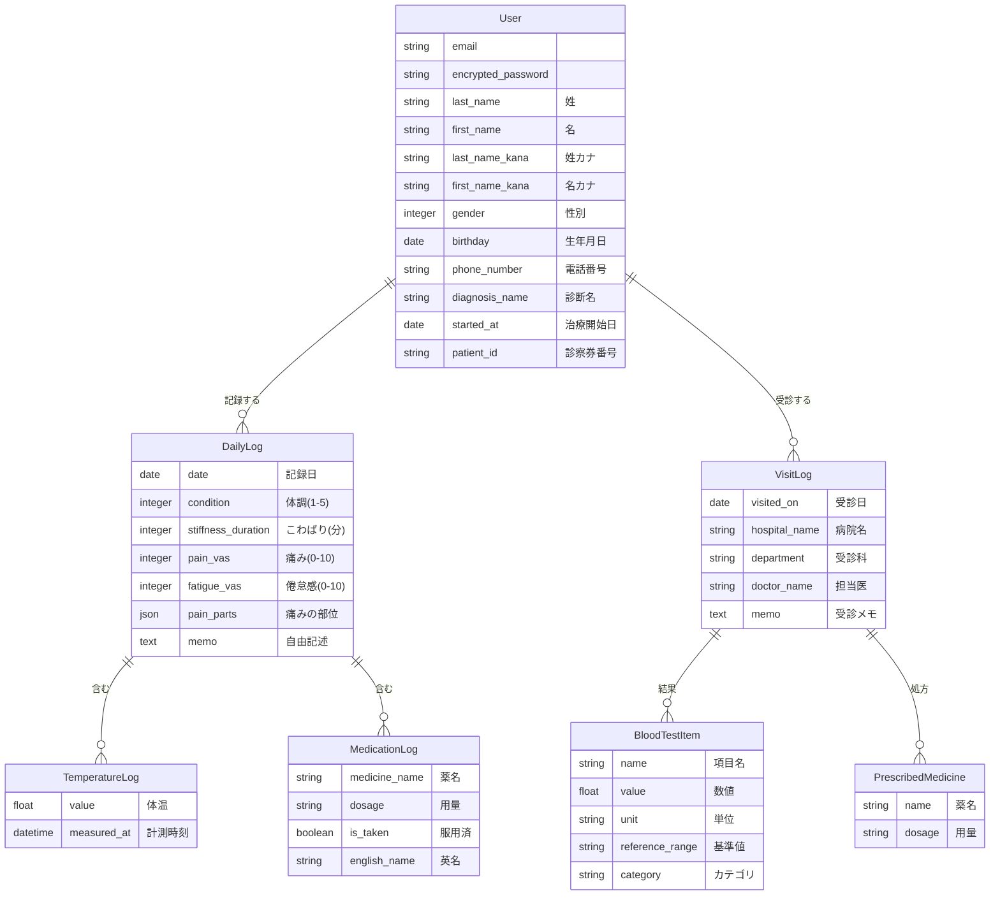

# MyHealth Log

**持病と上手に付き合って、自分らしい生活を**

疾患と向き合うすべての人が安定した社会生活を送るための、データ駆動型ヘルスケアプラットフォーム

## アプリケーション概要
MyHealth Logは、膠原病や免疫疾患などの希少疾患・慢性疾患を持つ患者が、日々の体調変化を「論理的に管理・分析」し、最適な治療と社会生活の両立を実現するためのヘルスケアプラットフォームです。

単なる記録ツールに留まらず、限られた診察時間での**「医師との情報の非対称性」を解消し、蓄積されたデータから「自分自身の体調の傾向」**を導き出すことで、持病を抱えながらも高いパフォーマンスを維持して社会参画し続けることを支援します。


## 開発背景と解決したい課題

### 自身の経験と課題意識
開発者自身が自己炎症性疾患である「家族性地中海熱」という希少疾患を抱えており、周期的な発熱発作や慢性的な痛みと向き合いながらキャリアを築いてきました。この疾患は症状の個人差が大きく、自身の体調の傾向を正確に把握し適切にコントロールすることが不可欠です。しかし、2〜3ヶ月に一度の定期受診という限られた時間の中で、数ヶ月間の体調推移を医師へ正確に伝えることには限界があり、**「情報の非対称性が、最適な治療方針の決定を妨げている」** という強い課題意識を持っていました。
その中で、**「自身の体調をデータ化し、客観的にコントロールすること」** ができれば、持病を抱えながらも安定した社会生活を送ることにつながると考え、本アプリを開発しました。

### 本アプリで解決したいこと
「MyHealth Log」は、単なる体調記録ツールではありません。患者が自身のデータを「論理的に管理・可視化」することで、以下の3点を目指しています。

**・診察の質を最大化する**： 言語化しにくい痛みや倦怠感などの日々の微細な変化をデータ化し、PDFレポート等で医師へ提示することで、短時間でも精度の高い診察を可能にします。

**・セルフマネジメントの確立**： 痛みや倦怠感の相関をグラフで可視化し、発作の予兆を捉えることで、仕事や生活への影響を最小限に抑えます。

**・希少疾患研究への貢献**： 指定難病や希少疾患は症例データが乏しく、治療法の確立が難しい現状があります。患者一人ひとりの詳細な記録が積み重なることで、将来的な疾患研究や新たな治療法の発見に寄与するプラットフォームを目指しています。


## 主な機能

### 1. 体調記録 (Daily Logs)
- **総合体調管理**: 5段階のアイコンで直感的に記録。
- **指標管理**: 痛みや倦怠感をVAS（0-10）で数値化。
- **バイタル記録**: 1日に複数回の体温測定結果を記録。
- **服薬チェック**: 処方薬の服用忘れを防止するチェックリスト機能。
- **ペインマップ**: 身体シェーマをタップして、痛みの部位（頭、関節など）を視覚的に記録。
- **朝のこわばり**: 持続時間を分単位で記録。

### 2. 受診・検査管理 (Visit Logs)
- **受診履歴**: 病院名、科目、担当医、医師からの指示をメモ。
- **血液検査データ**: 数値、単位、基準値を入力し、過去のデータと自動比較。
- **処方薬管理**: 受診時に新しく処方された薬剤の記録。

### 3. 分析・レポート機能
- **データ推移グラフ**: 体温、痛み、倦怠感の相関をグラフで可視化。
- **検査結果グラフ**: 特定の検査項目（CRPなど）の推移を追跡。
- **痛みの分析**: 期間を指定して痛みの部位分布をヒートマップ表示。
- **外部出力**: 医師に提示するためのPDFレポート生成およびCSVエクスポート。

[サンプルレポートPDF](./public/samples/summary_report.pdf)

蓄積された数ヶ月分のバイタルやVASスコアをA4 レポート形式に集約。医師が瞬時に患者の体調推移を把握できる状態にすることで、「感覚的な報告」から「データに基づいた論理的な診察」への転換をサポートします。

## AI Integration (Gemini API)

本アプリでは、GoogleのLLMである **Gemini 3 Flash** を活用し、データの利便性向上と解析を行っています。

### 実装の背景と意図
希少疾患や指定難病は国内の症例が少なく、最新の治療法や研究報告の多くは英語圏から発信されます。また、将来的な海外渡航や国際的な研究データへの寄与を見据えた際、国内の薬剤名だけではデータの汎用性に限界があると考えました。

### 実装済みの機能
- **LLMを用いたデータクレンジングと名寄せ**: 
  ユーザーが入力した自由形式の薬剤名を、Gemini APIを用いてリアルタイムで国際標準名称（英名）へ変換・構造化して保存します。これにより、表記揺れの吸収と将来的な外部データセットとの統合を容易にする**「データの意味的な名寄せ」**を実現しています。

## 今後の拡張予定 (Roadmap)
- **Pythonを用いた高度な統計解析・推論**: 
  現在はRails(Ruby)で基本的な可視化を行っていますが、今後はPython（Pandas / Scikit-learn）を用いたデータ分析パイプラインを統合予定です。蓄積されたVASスコアやバイタルデータに対し、相関分析や異常検知アルゴリズムを適用し、症状の悪化予兆を検知するエンジンの開発を検討しています。
- **非構造化データの高度な処理**: 
  Pythonのライブラリ（OpenCVやPyTesseract）を活用した血液検査結果の画像認識（OCR）機能の実装。
- **データ分析基盤の構築**: 
  蓄積されたDBデータをBigQuery等のDWHへ連携し、BIツールを用いたより高度な相関分析（気象データと疼痛の関係など）の可視化。

## データベース設計 (ER図)



## 技術スタック

- **Framework**: Ruby on Rails 7.1.x
- **Language**: Ruby 3.2.2, JavaScript (ES6+)
- **Database**: PostgreSQL (Amazon RDS)
- **Frontend**: JavaScript (Vanilla JS), Tailwind CSS, Hotwire (Turbo 8 / Stimulus 3), Importmaps (Buildless JS アセット管理)
- **Calendar**: Simple Calendar
- **Reporting**: Wicked PDF (wkhtmltopdf)
- **Charts**: Chartkick (Chart.js)
- **Authentication**: Devise
- **AI Integration**: Google Gemini API (薬剤データの多言語翻訳・解析)
- **Testing**: RSpec, FactoryBot
- **Infra**: AWS (App Runner, RDS) / Docker / Docker Compose
- **CI/CD**: GitHub Actions (if applicable) / App Runner Automatic Deployment

## セットアップ

```bash
# コンテナのビルドと起動
docker-compose up --build

# データベースの作成とマイグレーション
docker-compose exec web rails db:create
docker-compose exec web rails db:migrate
```
