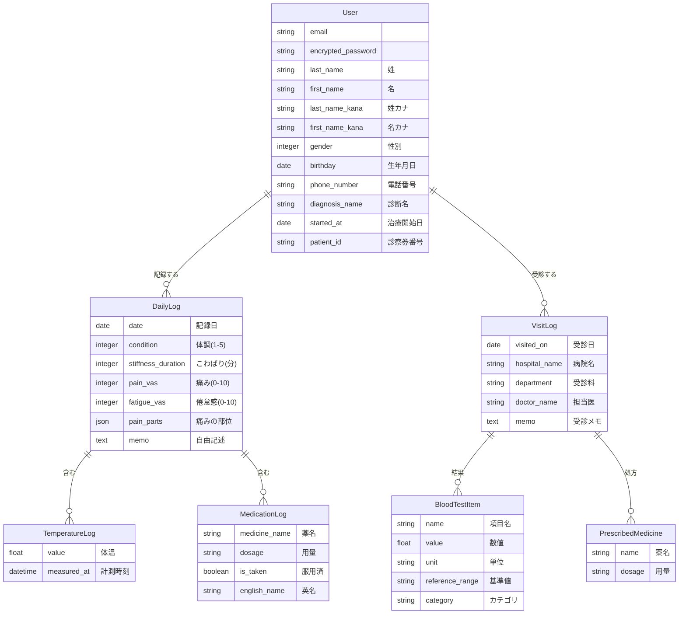

# MyHealth Log

MyHealth Logは、膠原病やリウマチなどの慢性疾患を持つ患者さんが、日々の体調変化や通院記録を簡単に管理・分析するためのヘルスケアプラットフォームです。

## 主な機能

### 1. 体調記録 (Daily Logs)
- **総合体調管理**: 5段階のアイコンで直感的に記録。
- **指標管理**: 痛みや倦怠感をVAS（0-10）で数値化。
- **バイタル記録**: 1日に複数回の体温測定結果を記録。
- **服薬チェック**: 処方薬の服用忘れを防止するチェックリスト機能。
- **ペインマップ**: 身体シェーマをタップして、痛みの部位（頭、関節など）を視覚的に記録。
- **朝のこわばり**: 持続時間を分単位で記録。

### 2. 受診・検査管理 (Visit Logs)
- **受診履歴**: 病院名、科目、担当医、医師からの指示をメモ。
- **血液検査データ**: 数値、単位、基準値を入力し、過去のデータと自動比較。
- **処方薬管理**: 受診時に新しく処方された薬剤の記録。

### 3. 分析・レポート機能
- **データ推移グラフ**: 体温、痛み、倦怠感の相関をグラフで可視化。
- **検査結果グラフ**: 特定の検査項目（CRPなど）の推移を追跡。
- **痛みの分析**: 期間を指定して痛みの部位分布をヒートマップ表示。
- **外部出力**: 医師に提示するためのPDFレポート生成およびCSVエクスポート。

## AI Integration (Gemini API)

本アプリでは、GoogleのLLMである **Gemini 3 Flash** を活用し、データの利便性向上と解析を行っています。

### 実装済みの機能
- **薬剤データの自動翻訳**: 
  ユーザーが日本語で処方薬を登録した際、バックエンドでGemini APIを呼び出し、国際的な標準名称（英名）を自動生成して保存します。これにより、将来的な海外渡航時のデータ提示や、外部データベースとの連携を容易にします。

### 今後の拡張予定 (Roadmap)
- **健康アドバイス生成**: 記録された体調（VASスコア）や検査数値の変化をAIが分析し、ユーザーにパーソナライズされた生活のアドバイスを提示。
- **検査結果の解釈補助**: 血液検査の数値が基準値を外れた際、その項目が持つ意味を分かりやすく解説する機能。
- **血液検査結果・処方箋・お薬手帳の画像解析**: OCRとGeminiの画像認識を組み合わせた、写真撮影による自動入力機能。

## データベース設計 (ER図)



## 技術スタック

- **Framework**: Ruby on Rails 7.1.x
- **Language**: Ruby 3.2.2
- **Database**: PostgreSQL
- **Frontend**: Tailwind CSS, Hotwire (Turbo / Stimulus)
- **Reporting**: Wicked PDF (wkhtmltopdf)
- **Charts**: Chartkick (Chart.js)
- **Authentication**: Devise
- **AI Integration**: Google Gemini API (薬剤データの多言語翻訳・解析)
- **Infra**: Docker / Docker Compose

## セットアップ

```bash
# コンテナのビルドと起動
docker-compose up --build

# データベースの作成とマイグレーション
docker-compose exec web rails db:create
docker-compose exec web rails db:migrate
```